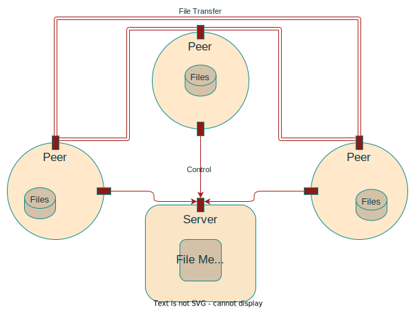

# P2P Filesystem Sharing

This repository contains a file-sharing P2P system. Here, we have a server that controls connections and shared files meta-data. As a client, you can get a list of all the registered files, search for a file, register a file, download a file, and delete your files' meta-data from the server as well.

This image further demonstrates the workflow:



## Building

Here you need to compile and run your server and clients separately:
```bash
$ cd /PATH TO PROJECT/server
$ make server
$ ./server
```
There is one server but you can have as many clients as you want, but for each client, you need to change the **P2PPORT** in **client.h**
```bash
$ cd /PATH TO PROJECT/client
$ make client
$ ./client
```
As a client you have five options:
- Enter 'R' to register a file
- Enter 'S' to search for a file (if found download it from the client)
- Enter 'U' to remove one of your files from the sharing list
- Enter 'O' to get the list of available files
- Enter 'E' to exit
## Wireshark
Here is a workflow of  demonstrates the workflow:

 