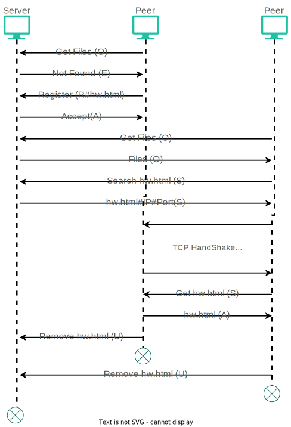

# P2P Filesystem Sharing

This repository contains a P2P file-sharing system. Here, we have a server that controls connections and shared files meta-data. As a client, you can get a list of all the registered files, search for a file, register a file, download a file, and delete your files' metadata from the server.

This image further demonstrates the architecture:


## Building

Here you need to compile and run your server and clients separately:
```bash
$ cd /PATH TO PROJECT/server
$ make server
$ ./server
```
There is one server, but you can have as many clients as you want, but for each client, you need to change the **P2PPORT** in **client.h** and build them separately:
```bash
$ cd /PATH TO PROJECT/client
$ make client
$ ./client
```

## How it works
The server communicates with peers to send and receive metadata to each peer using UDP. Peers transfer data with each other via TCP.
As a peer, you have five options:
- Enter 'R' to register a file to the server and declare yourself as a provider for that file
- Enter 'S' to search for a file (if found, download it from the client and declare yourself as a provider for that file.)
- Enter 'U' to remove yourself as a provider for one of your particular files
- Enter 'O' to get the list of available files
- Enter 'E' to exit
## Example
Here is the scenario for the pcap file provided in the repository:
- We have a server with two peers
- Peer_1 requests the list of available files
- Peer_1 registers hw.html (hello world)
- Peer_2 requests the list of available files
- Peer_2 requests for the hw.html
- Server sends providers ip and port, which in this case is Peer_1's to Peer_2
- Peer_2 requests hw.html from Peer_1
- Peer_1 sends hw.html to Peer_2
- Peer_1 removes itself from the providers for hw.html
- Peer_1 exits
- Peer_2 removes itself from the providers for hw.html
- Peer_2 exits

 